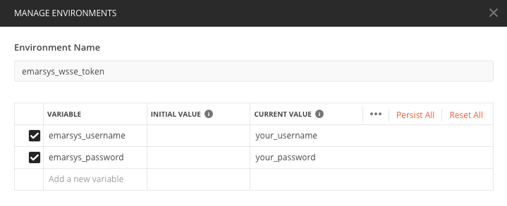
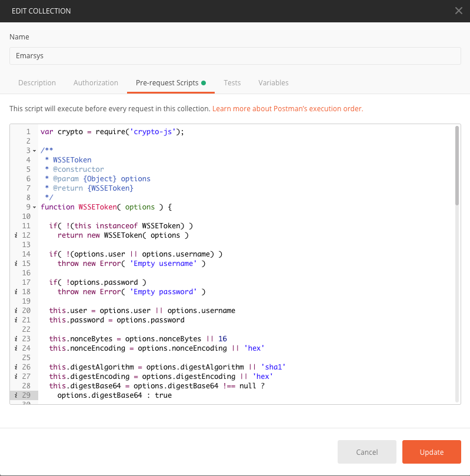
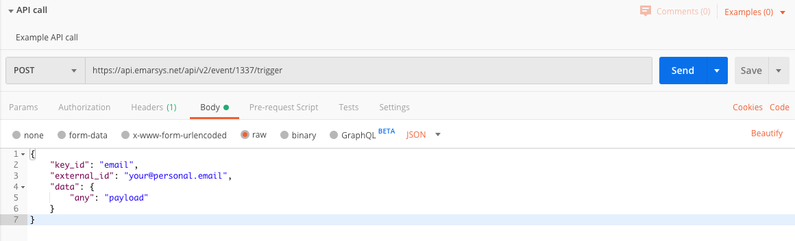
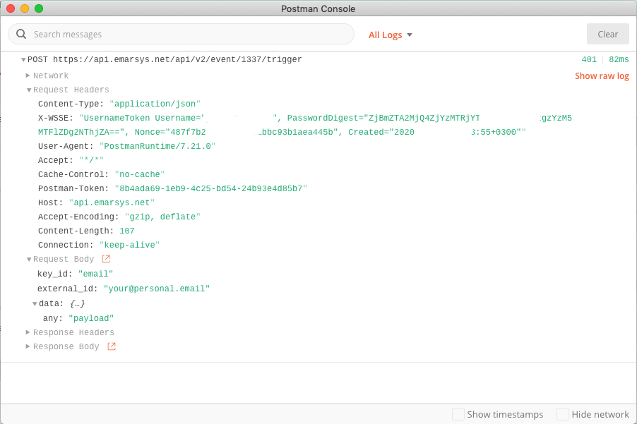

# PostmanWSSEToken

Pre-request script for Postman provide auth header generation for API calls in Emarsys

## Requirements

- Postman 7.12+ 
- crypto-js

## Installation

- Import environment [emarsys_wsse_token.postman_environment.json](src/emarsys_wsse_token.postman_environment.json)
- Provide your username and password in environment management in Postman\

- Create collection
- Copy/Paste contents of [prerequest.script.js](src/prerequest.script.js) in `Pre-request Scripts` of your collection\

## Usage

- Create requests to API Emarsys in Postman and Send it\

- The script will add all necessary authentification headers to your request\

## Related

- <https://dev.emarsys.com/v2/emarsys-developer-hub/what-is-the-emarsys-api>
- <https://learning.getpostman.com/docs/postman/scripts/pre_request_scripts/>
- <https://github.com/jhermsmeier/node-wsse-token>
